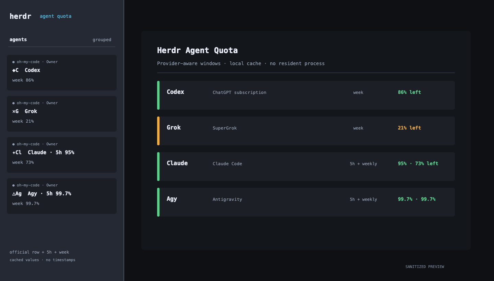

# herdr-agent-quota

Show Claude Code, Codex, Grok, and Agy subscription usage in Herdr's agent
sidebar.



The checked-in preview is sanitized: it contains no account, workspace, or
credential data.

This Rust plugin keeps the latest successful provider snapshot in a small local
cache and publishes compact text tokens to Herdr agent rows. It does not run a
resident daemon: Herdr startup, agent events, or a manual refresh perform a
one-shot update. If a later refresh fails, the previous value remains visible.

## What it shows

```text
Codex OK
  week 39% left
Grok WARN
  week 21% left
Claude OK
  5h 42% left · week 73% left
Agy OK
  5h 99.7% left · week 99.7% left
```

The value is the percentage left in the provider's subscription window, not a
token count. `OK` means more than 30% remains, `WARN` means 10–30% remains, and
`LOW` means less than 10% remains. `N/A` means that provider has never produced
a usable snapshot on this machine. The plugin keeps the last successful value;
a failed refresh does not replace it with `unavailable`.

The sidebar is intentionally text-based. Herdr plugin v1 accepts custom text
tokens but cannot inject brand SVG/PNG icons into its Agent renderer. The
sidebar therefore uses compact lettered markers (`◈C`, `✕G`, `✦Cl`, `△Ag`)
beside the CLI name, without repeating a long provider name.

## Data sources and privacy

- Codex: the local `codex app-server --stdio` JSON-RPC account/rate-limits
  contract. Only the seven-day window is shown. API-key mode is reported as
  unavailable because it is not the ChatGPT subscription quota.
- Grok: the local `~/.grok/auth.json` login key is read in memory and sent to the
  Grok CLI billing backend used by Grok Build. The response is accepted only when
  its period is explicitly weekly. This is SuperGrok subscription usage, not xAI
  developer/API-team billing.
- Claude Code: the official `statusLine` JSON hook supplies five-hour and
  seven-day windows. `configure --apply` backs up and chains an existing
  statusLine command.
- Agy/Antigravity: the official [`/usage` quota panel](https://antigravity.google/docs/cli/commands/usage?app=antigravity-ide)
  and `statusLine` JSON `quota` object supply
  `gemini-5h`/`gemini-weekly` and `3p-5h`/`3p-weekly` windows. The sidebar uses
  the lowest remaining value when both pools are present, so one Agy row is
  conservative across Gemini and Claude/GPT model groups. No public API or
  browser credential is used.

The plugin does not access browser Cookies or browser Keychains, does not upload
usage data, does not refresh provider credentials, and does not save bearer or
refresh tokens. Provider failures never replace a successful cached snapshot.

The Grok CLI billing endpoint is an internal CLI contract rather than a public
stability guarantee. If xAI changes it, the plugin leaves the previous value in
place and reports the failure in the detail pane/action output.

## Build and local link

Requirements: Herdr `v0.8.0+`, Rust `1.95.0`, Codex `0.147.0`, Claude Code
with the official `statusLine` `rate_limits` fields, and Agy/Antigravity
`1.1.x` for its official `statusLine` `quota` object. macOS and Linux are
supported.

```sh
cargo test --locked
cargo build --release --locked
herdr plugin link .
```

Then use the Herdr plugin action `Refresh agent quota` or run:

```sh
./target/release/herdr-agent-quota configure --check
./target/release/herdr-agent-quota configure --apply
```

`configure --apply` makes a small, idempotent sidebar-row edit and installs the
reversible Claude statusLine wrapper. `configure --uninstall` removes only the
plugin-owned row and restores the previous Claude statusLine. The manual sidebar
row is:

```toml
[ui.sidebar.agents]
rows = [
  ["state_icon", "pane", "tab"],
  ["agent", "$quota_icon", "$quota_5h"],
  ["$quota_week"],
]
```

这保留 Herdr 官方的状态/pane/Tab 提示，但不展示目录；5h 在第一条配额行，完整的 `week` 在下一行。
`$quota_icon` 是紧凑的提供商标识，避免 CLI 名称与提供商名字重复。如果你已有自己的
`rows`，保留原有 token，只加入 `$quota_icon`、`$quota_5h` 和 `$quota_week`。

Herdr 左侧只能渲染文本 token，不能由插件注入 SVG；仓库中的
[`docs/icons/`](docs/icons/) 是可复用的彩色 SVG 标识，详情 pane/README 预览会使用它们，
sidebar 则使用带字母的文本 fallback（`◈C`、`✕G`、`✦Cl`、`△Ag`）。

To feed Agy's lightweight statusLine hook, set its native `/statusline` command
to the built binary (the command receives JSON on stdin):

```text
/statusline /absolute/path/to/herdr-agent-quota/target/release/herdr-agent-quota agy-statusline
```

This is a one-shot hook, not a resident process. It saves only the sanitized
quota percentages locally and publishes them to the Agy agent row.

The optional `Agent quota` pane is read-only. Press `r` to force one refresh and
`q` to close it; it does not poll.

## Development checks

```sh
cargo fmt --all -- --check
cargo clippy --all-targets --all-features -- -D warnings
cargo test --all-targets --all-features --locked
cargo build --release --locked
```

See [`docs/research/codexbar-grok-usage.md`](docs/research/codexbar-grok-usage.md)
for the Grok source investigation and
[`docs/plans/herdr-agent-quota-implementation.md`](docs/plans/herdr-agent-quota-implementation.md)
for the implementation contract.

## Herdr Marketplace discovery

This repository includes the required root `herdr-plugin.toml` and the GitHub
`herdr-plugin` topic. Herdr's marketplace indexes public repositories carrying
that topic; the listing refresh is asynchronous. Additional discovery topics
include `agy`, `antigravity`, `gemini`, `claude-code`, `codex`, `grok`,
`agent-usage`, and `quota-monitor`.

## License

MIT. This project is not affiliated with Herdr, OpenAI, Anthropic, xAI, or Google.
