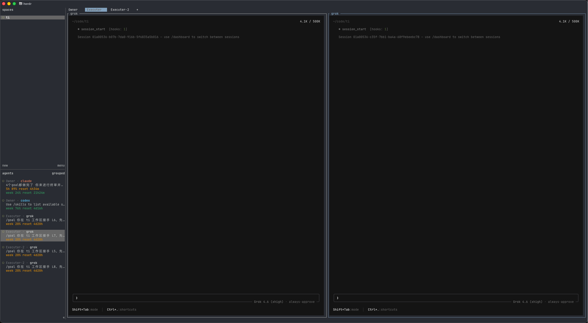

# herdr-agent-quota

[](https://www.rust-lang.org/)
[](https://herdr.dev/docs/plugins/)
[](LICENSE)
[](https://github.com/levi-qiao/herdr-agent-quota)

[English README](README.md)

在 Herdr 左侧 Agents 列表中显示 Claude Code、Codex、Grok 和
Agy/Antigravity 的订阅额度。每个 agent 使用三行紧凑布局：第一行显示
plane 和 CLI 名称，第二行显示剩余用量，第三行显示当前话题。



这是项目使用的真实 Herdr 本地会话截图。截图中的额度和话题来自当时的
会话，不是插件写死的示例数据。

## 快速开始

要求：Herdr `0.8.0+`、Rust `1.95+`、macOS 或 Linux，以及至少一个支持的
CLI。在仓库目录执行：

```sh
herdr plugin link .
./target/release/herdr-agent-quota configure --apply
herdr server reload-config
```

以上就是完整的 Herdr 配置流程：

- `herdr plugin link .` 构建 Rust 二进制并注册启动/事件钩子。
- `configure --apply` 幂等地写入三行 sidebar 配置，并安装可恢复的
  Claude Code `statusLine` 包装器。
- 也可以在 Herdr action 菜单中执行 **Configure agent quota sidebar**。
- 需要手动刷新时执行 **Refresh agent quota**。

只查看配置变更、不写入文件：

```sh
./target/release/herdr-agent-quota configure --check
```

插件会保留 Herdr 原生的状态圆点和 plane/tab 提示，只追加 provider、
usage、topic 三类 token，不会覆盖官方 agent 指示。执行
`configure --uninstall` 可以删除插件添加的行，并恢复原来的 Claude
`statusLine`。

## 支持的 CLI

| CLI | 侧栏显示 | 本地数据来源 | 额外配置 |
| --- | --- | --- | --- |
| Claude Code `2.1.232` | `5h` + `week` | 官方 `statusLine` JSON：`rate_limits.five_hour`、`seven_day` | `configure --apply` 会串联已有 `statusLine` 命令 |
| OpenAI Codex `0.147.0` | `week` | 一次性的 `codex app-server --stdio`，调用 `account/rateLimits/read` | 使用 ChatGPT 订阅登录；API key 模式显示为不可用 |
| Grok CLI / Grok Build `1.0.3` | `week` | `~/.grok/auth.json` 和官方 CLI 使用的额度接口 | 登录 Grok CLI；不会读取 xAI team/API 账单 |
| Agy / Antigravity CLI `1.1.13` | `5h` + `week` | 官方 `statusLine` JSON 的 `quota`（`gemini-*`、`3p-*`） | 需要一次性设置原生 `/statusline` 命令 |

上面的版本是 2026-08-15 在开发机上实际检查的版本。解析器按照供应商的
字段工作，不会把这些版本号写死；兼容的新版本可以继续使用。

侧栏显示的是**剩余百分比**，不是 token 数量，也不显示重置时间：

```text
● Owner · Claude
  5h 100% · week 31%
  hi
```

Codex 和 Grok 提供周额度；Claude Code 和 Agy 提供 5 小时额度与周额度。
刷新失败时，插件会保留上一次成功的缓存值，不会把旧值清空为
`unavailable`。从未成功采集过的 provider 才会显示 `N/A`。

## Agy / Antigravity 配置

Agy 通过原生的一次性 `statusLine` hook 把额度 JSON 传给插件。在 Agy 中
设置一次：

```text
/statusline /absolute/path/to/herdr-agent-quota/target/release/herdr-agent-quota agy-statusline
```

该 hook 从 stdin 读取 JSON，只把脱敏后的百分比写入本地插件缓存，然后退出。
它不是常驻进程，也不使用浏览器 Cookie 或私有 API。

## 侧栏布局

默认配置保持紧凑，并且每个 provider 名称只显示一次：

```toml
[ui.sidebar.agents]
rows = [
  ["state_icon", "tab", "$quota_provider"],
  ["$quota_summary"],
  ["$quota_topic"],
]
```

- `state_icon`、`tab` 是 Herdr 内置的状态和 plane 标签。
- `$quota_provider` 是 `Claude`、`Codex`、`Grok` 或 `Agy`。
- `$quota_summary` 是 `5h ... · week ...` 或 `week ...`。
- `$quota_topic` 是 pane 输出中最近一次用户输入/话题的摘要。

Herdr plugin v1 只支持文本 token，不能由插件向原生 Agent renderer 注入
品牌 SVG/PNG。因此默认使用清晰的 provider 名称和 Herdr 原生圆点，不再
添加辨识度不高的 Unicode 图标。仓库中的 [`docs/icons/`](docs/icons/) 只
作为可选视觉参考，不会被注入左侧原生 sidebar。

话题读取由事件触发：插件扫描 pane 最近输出，优先提取最新用户输入；如果
CLI 还没有打印 prompt，则回退到原生终端标题。不会显示工作目录。

## 数据来源与隐私

- **Codex：** 使用本地官方
  [app-server JSON-RPC](https://github.com/openai/codex/blob/main/codex-rs/app-server/README.md)
  的 rate-limit 响应，按窗口时长识别周额度。API key 登录不会被误标记为
  ChatGPT 订阅额度。
- **Grok：** 在内存中读取本地 `~/.grok/auth.json` 登录 key，访问 Grok CLI
  使用的周额度接口。只有明确标记为 weekly 的响应才会接受。这是
  SuperGrok 订阅额度，不是 xAI 开发者/API team 账单。
- **Claude Code：** 使用官方
  [`statusLine` JSON hook](https://code.claude.com/docs/en/statusline) 提供
  5 小时和 7 天额度。原有 statusLine 会被备份、串联，并可由
  `configure --uninstall` 恢复。
- **Agy/Antigravity：** 使用官方
  [`/usage` 和 statusline 文档](https://antigravity.google/docs/cli/commands/usage?app=antigravity-ide)
  中的 Gemini 和第三方额度池。两个额度池同时存在时，取较低的剩余百分比，
  让单个 Agy 行保持保守。

快照和刷新标记保存在 Herdr 插件状态目录中。插件不会上传使用数据，不读取
浏览器 Cookie/Keychain，不刷新或写入 provider 凭据。provider 失败时保留
上一次成功的本地值。

Grok CLI 的额度接口属于 CLI 内部契约，不是 xAI 面向开发者的公开稳定 API。
如果接口变化，插件会保留上一周额度，而不是清空侧栏。

## 常见问题

| 现象 | 处理方式 |
| --- | --- |
| 侧栏没有新增行 | 执行 `herdr server reload-config`，再运行 **Refresh agent quota**。 |
| Claude 或 Agy 显示 `N/A` | 发起一次对话，让原生 `statusLine` 产生 JSON，然后刷新。 |
| 切换 pane 时 Claude 短暂变化 | 已有缓存会保留；如果还没有快照，发送一次 prompt 或手动刷新。 |
| Agy 没有额度 | 确认原生 `/statusline` 命令指向编译好的 `agy-statusline` hook。 |
| 话题为空或没有更新 | 在该 pane 发送 prompt；话题提取依赖 agent 事件和最近输出。 |
| 原有 Claude statusLine 没有被修改 | 执行 `configure --check`；对于不能安全串联的配置，插件会拒绝覆盖。 |

## 开发检查

```sh
cargo fmt --all -- --check
cargo clippy --all-targets --all-features -- -D warnings
cargo test --all-targets --all-features --locked
cargo build --release --locked
```

Grok 调研记录见
[`docs/research/codexbar-grok-usage.md`](docs/research/codexbar-grok-usage.md)，
实现约定见
[`docs/plans/herdr-agent-quota-implementation.md`](docs/plans/herdr-agent-quota-implementation.md)。

## Herdr Marketplace 与发现

仓库根目录包含 `herdr-plugin.toml`，仓库为公开仓库，并设置了 GitHub
`herdr-plugin` topic。Herdr Marketplace 会索引带有该 topic 的公开仓库，
刷新是异步的。仓库同时设置了 `claude-code`、`codex`、`grok`、`agy`、
`antigravity`、`gemini`、`agent-usage`、`quota-monitor`、`usage-monitor`、
`provider-usage`、`rust`、`sidebar` 等主题，方便按 provider 或用途搜索。

如果这个插件帮你减少了 pane 切换，欢迎给仓库点 Star，或提交包含 CLI
版本号的 issue，帮助我们优先支持下一批 provider。

## 许可证

MIT。本项目与 Herdr、OpenAI、Anthropic、xAI 或 Google 没有隶属关系。
